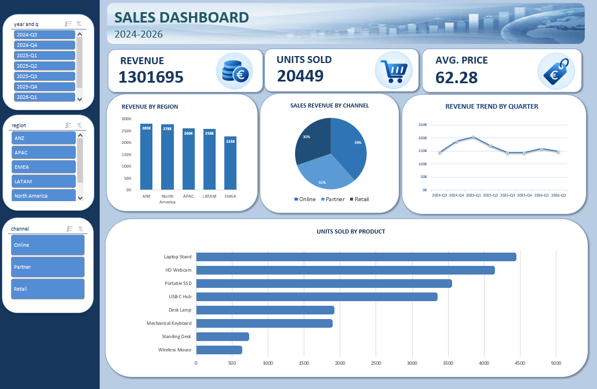

# Excel Sales Dashboard 📊

An interactive Excel dashboard designed to analyze sales performance, revenue, units sold, average price, product performance, and sales trends.

## 📊 Dashboard

## 🎯 Project Overview

The goal of this project was to transform raw sales data into a clear and interactive Excel dashboard that allows users to explore key business performance metrics.

The project includes data preparation, PivotTables, PivotCharts, calculated fields, and interactive filters to provide a simple and effective view of sales performance.

## 🛠️ Tools Used

- **Microsoft Excel** – Data cleaning, analysis, and dashboard creation
- **PivotTables** – Data aggregation and analysis
- **PivotCharts** – Data visualization
- **Slicers** – Interactive filtering

## 🔎 Analysis

The dashboard analyzes:

- Total revenue
- Units sold
- Average selling price
- Revenue by region
- Revenue by product
- Revenue by country
- Sales trends over time
- Product performance

## 💡 Key Features

- Interactive dashboard with multiple slicers
- Dynamic filtering by year, quarter, region, and country
- KPI cards for key sales metrics
- PivotTables and PivotCharts connected to the dashboard
- Clear visual comparison of sales performance

## 📁 Repository Files

- `Excel_Sales_Dashboard.xlsx` – Complete Excel workbook
- `excel_sales_dashboard.png` – Dashboard preview

## 📌 Skills Demonstrated

Excel • Data Cleaning • Data Analysis • PivotTables • PivotCharts • Data Visualization • Dashboard Design
